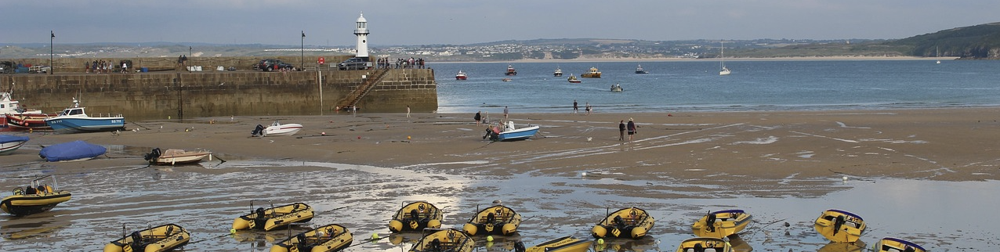
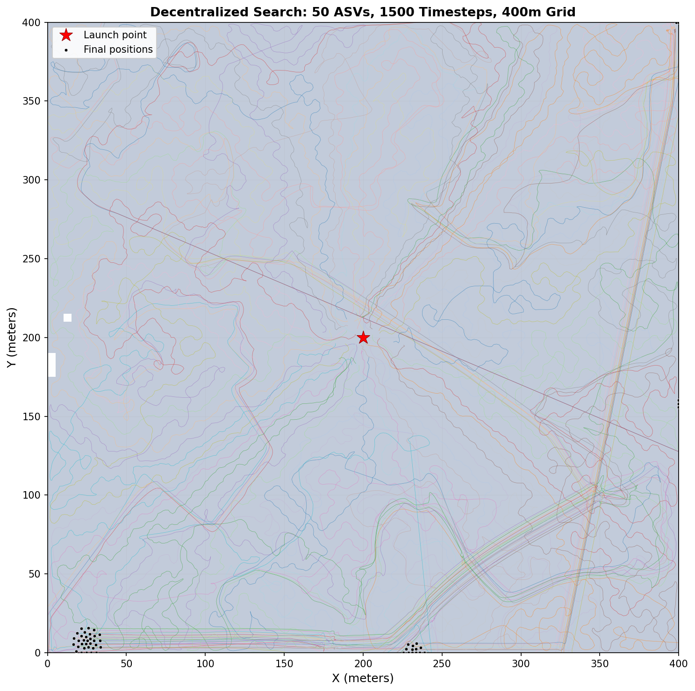
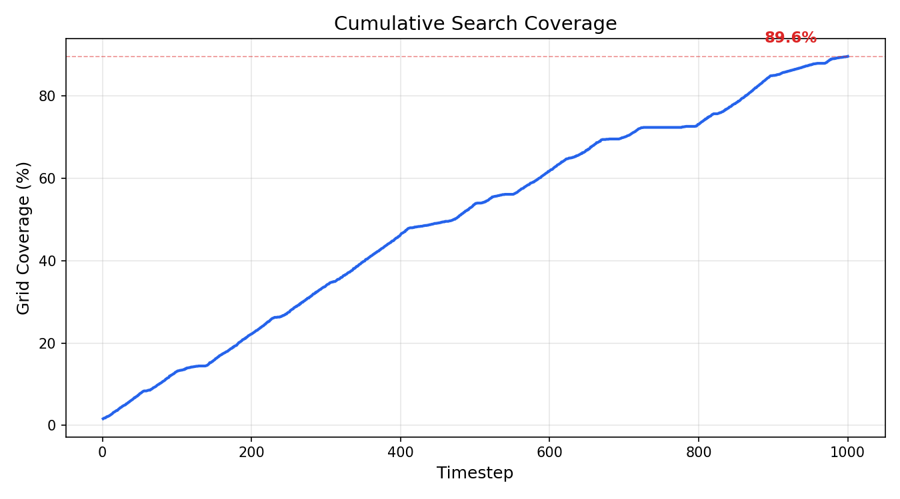

<p align="center">
  
</p>

## Project rationale

Imagine 50 tiny robots in a room. Each one follows two simple rules: don't crash into your neighbor, and spread out to cover the whole room. Like how birds fly in a flock without a leader telling them where to go. The code simulates this and measures how much floor they cover.

# Multi-Agent Spatial Coverage Simulation

Decentralized coverage simulator built on Lennard-Jones potential fields and a sweep heuristic. Each agent computes its heading from neighbor positions and local coverage state. The question it answers: given N agents with limited sensing range, how quickly can they sweep a region using only local information?


## What the project finds

50 autonomous agents launched from a single point achieve **99.9% grid coverage** of a 400x400 meter search area in 1500 timesteps using only local sensing (25-meter radius). No agent has access to global state. The emergent search pattern fans outward from the launch point, with agents naturally partitioning space through separation pressure and sweep bias toward unvisited cells.

Coverage grows sublinearly: the fleet covers 25% by step 96, 50% by step 180, and 75% by step 292. Beyond 90% coverage, marginal returns diminish sharply as agents must traverse longer paths to reach isolated unvisited cells in corners and boundaries.

### Search Trajectories

<p align="center">
  
</p>

### Coverage Over Time

<p align="center">
  
</p>

## Mathematical formulation

Each agent $i$ updates its velocity $\mathbf{v}_i$ at each timestep by computing a weighted sum of four normalized steering vectors:

$$\mathbf{v}_i^{(t+1)} = \mathbf{v}_i^{(t)} + w_s \hat{\mathbf{f}}_s + w_a \hat{\mathbf{f}}_a + w_c \hat{\mathbf{f}}_c + w_r \hat{\mathbf{f}}_r$$

where:

| Symbol | Weight | Definition |
|--------|--------|------------|
| $\hat{\mathbf{f}}_s$ | $w_s = 2.0$ | **Separation**: $\sum_{j \in N_i} \frac{\hat{\mathbf{r}}_{ij}}{\|\mathbf{r}_{ij}\|^2}$ (inverse-square repulsion for $d < 8$m) |
| $\hat{\mathbf{f}}_a$ | $w_a = 0.3$ | **Alignment**: $\frac{1}{|N_i|} \sum_{j \in N_i} \mathbf{v}_j - \mathbf{v}_i$ (velocity matching) |
| $\hat{\mathbf{f}}_c$ | $w_c = 0.5$ | **Cohesion**: $\frac{1}{|N_i|} \sum_{j \in N_i} \mathbf{p}_j - \mathbf{p}_i$ (center-of-mass attraction) |
| $\hat{\mathbf{f}}_r$ | $w_r = 1.8$ | **Sweep heuristic**: $\mathbf{c}^* - \mathbf{p}_i$ where $\mathbf{c}^*$ is the nearest unvisited cell center |

All four vectors are normalized to unit magnitude before weighting. $N_i$ is the set of agents within the perception radius $r = 25$m of agent $i$. The speed is clamped to $[0.3, 1.8]$ m/timestep after summation.

The simulation uses a **synchronous two-pass update**: all agents compute $\mathbf{v}_i^{(t+1)}$ from the frozen state at time $t$, then all positions update simultaneously. This eliminates dependence on agent indexing order.

## How it works

**1. The Agent Math (`agents.py`)**

Each vessel computes a steering vector from four components using only local information:

| Component | Weight | Purpose |
|-----------|--------|---------|
| Separation | 2.0 | Inverse-square repulsion within 8m to prevent collision |
| Alignment | 0.3 | Match heading with visible neighbors |
| Cohesion | 0.5 | Steer toward local center of mass |
| Sweep | 1.8 | Bias toward nearest unvisited grid cell (local window) |

All four vectors are normalized before weighting, so the weights directly control relative influence. The final velocity is clamped to a maximum speed of 1.8 m/timestep with a minimum of 0.3 m/timestep to prevent stalling. This extends the Boids model (Reynolds 1987) with a spatial coverage objective.

The sweep heuristic searches a local window of 8 grid cells around the agent and adds a small random offset to break ties. This prevents all agents from converging on the same target cell.

**2. The Simulation Engine (`simulation.py`)**

A kinematic loop spawns 50 agents at a central launch point with random initial headings. Each timestep uses a **two-pass update** to eliminate order-dependent behavior:
1. All agents compute their steering vectors from the current frozen state.
2. All agents apply their updates simultaneously.

A discrete coverage grid (80x80 cells over 400x400 meters) tracks which cells have been visited. Agents are bounded to the search area via position clamping.

**3. The Spatial Visualizer (`solve.py`)**

Runs the simulation for 1500 timesteps and generates two plots. The trajectory plot overlays all 50 agent paths on the coverage grid, showing the fan-out pattern from the launch point. The coverage curve tracks the fraction of cells visited over time, with milestone annotations at 25%, 50%, and 75%.

## Project structure

```
bio-mimetic-swarm/
    agents.py               # vector math: separation, alignment, cohesion, sweep
    simulation.py           # kinematic loop, coverage tracking, two-pass update
    solve.py                # runner, trajectory plot, coverage curve
    src/swarm/
        engine.py           # physics engine with symplectic integration
        config.py           # YAML scenario loader
        forces_c.c          # C extension for pairwise LJ forces
        forces_native.py    # pure Python fallback for force computation
        renderer.py         # matplotlib trajectory and coverage renderer
    configs/                # scenario presets (oil spill, search and rescue, stress test)
    tests/                  # physics invariants and config validation
    docs/                   # architecture, math derivations, requirements
    results/                # output plots and banner images
```

## Assumptions and limitations

This simulation makes several simplifying assumptions:

- **No ocean currents or drift.** Agents move in a static fluid. Real ASVs must compensate for tides, wind, and wave drift.
- **No communication latency.** Neighbor sensing is instantaneous within the perception radius. Real radio links introduce delay and packet loss.
- **Infinite energy.** Agents never run out of fuel or battery. Real missions must account for return-to-base constraints.
- **Flat 2D plane.** The search area has no obstacles, coastlines, or bathymetry. Real maritime environments are rarely featureless.
- **Fixed fleet size.** No agents are added or lost during the mission. Real operations must handle agent failure and dynamic redeployment.

Compared to structured algorithms (parallel sweep, Voronoi partitioning), the decentralized approach trades optimality for fault tolerance: no single agent failure can collapse the search plan. A formal comparison to these baselines is left as future work.

## Running

```bash
pip install -r requirements.txt
python solve.py
```

Results are saved to `results/`.

## References

1. Reynolds, C. W. (1987). "Flocks, Herds, and Schools: A Distributed Behavioral Model." *Computer Graphics (SIGGRAPH '87 Proceedings)*, 21(4), 25-34.

2. Koopman, B. O. (1980). *Search and Screening: General Principles with Historical Applications*. Pergamon Press. ISBN 978-0080231358.

3. Breivik, O. & Allen, A. A. (2008). "An Operational Search and Rescue Model for the Norwegian Sea and the North Sea." *Journal of Marine Systems*, 69(1-2), 99-113.


## Active Research Extension

- This engine is being adapted for port logistics. The same coordination framework (local sensing, decentralized velocity updates, spatial coverage tracking) applies to analyzing freight movement workflows and identifying throughput constraints across port terminals.
- The thesis version replaces the open-sea search objective with a cargo distribution objective, measuring how efficiently autonomous transport nodes service a bounded logistics area.
## License

MIT License. See [LICENSE](LICENSE).
