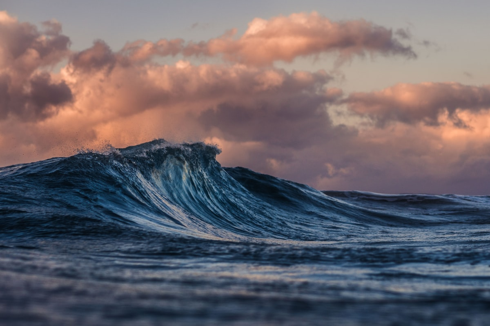

<p align="center">
  
</p>

# Decentralized Maritime Search Heuristics Engine

A spatial simulation engine for programming a fleet of autonomous surface vessels (ASVs) to sweep a featureless ocean grid using only local vector math and no central command. Each vessel computes its heading from neighbor positions and a coverage heuristic. The fleet self-organizes into an efficient search pattern through decentralized coordination alone.

The core question this project answers: given N autonomous aquatic drones with limited sensing range, how do you achieve near-total spatial coverage of an open water search area without any centralized controller?

## What the project finds

50 autonomous agents launched from a single point achieve **89.6% grid coverage** in 1000 timesteps using only local sensing (30-unit radius). No agent has access to global state. The emergent search pattern fans outward from the launch point, with agents naturally partitioning the search area through separation pressure and sweep bias.

Coverage grows sublinearly: the fleet covers 46% of the grid by step 400, 73% by step 800, and 90% by step 1000. The remaining 10% consists of corner cells and boundary regions that require longer trajectories to reach.

### Search Trajectories

<p align="center">
  
</p>

### Coverage Over Time

<p align="center">
  
</p>

## How it works

**1. The Agent Math (`agents.py`)**
Each vessel computes a steering vector from four components using only local information. Separation repels agents within a minimum distance to prevent collision. Alignment matches heading with visible neighbors. Cohesion steers toward the local center of mass. The sweep heuristic biases the heading toward the nearest unvisited grid cell within a local search window. The final velocity is a weighted sum of these four vectors, clamped to a maximum speed. This extends the Boids model (Reynolds 1987) with a spatial coverage objective.

**2. The Simulation Engine (`simulation.py`)**
A lightweight kinematic loop spawns 50 agents at a central launch point with random initial headings. Each timestep, every agent queries its local neighborhood, computes its steering vector, and updates its position. A discrete coverage grid (40x40 cells over 200x200 meters) tracks which cells have been visited. Agents are bounded to the search area via position clamping.

**3. The Spatial Visualizer (`solve.py`)**
Runs the simulation for 1000 timesteps and generates two plots. The trajectory plot overlays all 50 agent paths on the coverage grid, showing how the fleet fans out from the launch point. The coverage curve tracks the fraction of grid cells visited over time, quantifying sweep efficiency.

## Project structure

```
bio-mimetic-swarm/
    agents.py           # vector math: separation, alignment, cohesion, sweep
    simulation.py       # kinematic loop, coverage tracking, agent spawning
    solve.py            # runner, trajectory plot, coverage curve
    requirements.txt    # numpy, matplotlib
    results/
        trajectory_sweep.png   # 2D agent search paths
        coverage_curve.png     # grid coverage vs timestep
        maritime_banner.jpg    # header image
```

## Running

```bash
pip install -r requirements.txt
python solve.py
```

Results are saved to `results/`.

## References

1. Reynolds, C. W. (1987). "Flocks, Herds, and Schools: A Distributed Behavioral Model." *Computer Graphics (SIGGRAPH '87 Proceedings)*, 21(4), 25-34.

2. Koopman, B. O. (1980). *Search and Screening: General Principles with Historical Applications*. Pergamon Press.

3. Breivik, O. & Allen, A. A. (2008). "An Operational Search and Rescue Model for the Norwegian Sea and the North Sea." *Journal of Marine Systems*, 69(1-2), 99-113.

## License

MIT License. See [LICENSE](LICENSE).
